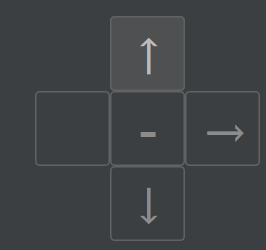
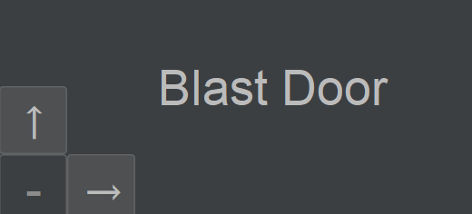
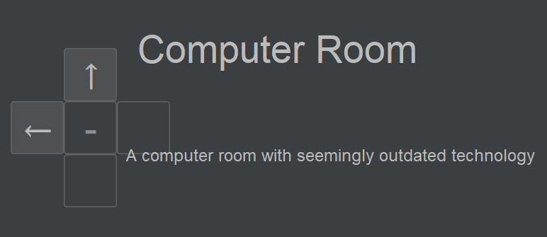
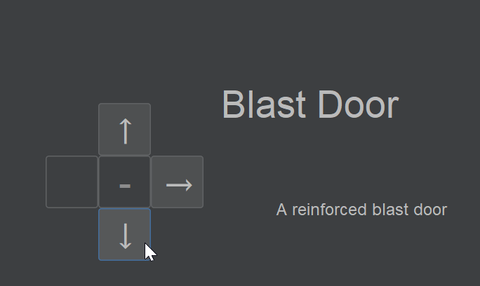

# Development Log

The development log captures key moments in your application development:

- **Design ideas / notes** for features, UI, etc.
- **Key features** completed and working
- **Interesting bugs** and how you overcame them
- **Significant changes** to your design
- Etc.

---

## Date: 19/03/2025

I have coded the movement GUI of my game:



So far, this system is only 'for show' - the buttons don't actually do anything, as I haven't coded the movement system in. Still, it provides a good idea of how the movement interface will work. Keeping in mind this is subject to change, I have clickable arrows for directions that the player can move, greyed out arrows for blocked directions (e.g. a locked door), and blank buttons for directions the play cannot move. The button in the centre will be for going up / down elevators and stairs.

---

## Date: 21/03/2025

I have coded player movement. The way this works is that the movement buttons have action listeners which call the move() function, which sets the current scene to the one directly north or east etc:
```kotlin
    fun move(dir: Char) {
        when (dir) {
            'n' -> currentLocation = currentLocation?.adjacentScene('n') // Nullable as buttons disabled
            'e' -> currentLocation = currentLocation?.adjacentScene('e')
```
In keeping with the object-oriented nature of this project, I have also coded the adjacentScene() function that returns the scene object in a given direction.

I have also added a simple title that shows what room you're currently in:



For my next stages of development, I need to think about adding a better description of the room that the player is in. I think I will do this by adding a description attribute to my scene class.


---

## Date: 24/03/2025

I have added a label that describes the location the player is in:



Currently, it doesn't look very pretty. I haven't bothered making it look tidy as I'm going to make sure all the base features work before I waste time prettifying everything.

My map is going to have different levels, with elevators / stairs connecting them. I have got this feature working - for the most part it just re-uses the same lateral movement code. Again, it doesn't look pretty yet, but nonetheless:



I have started work on a system for unlocking locked doors - currently, I've coded a way to lock them on initialisation, and I've added an UNLOCK button to the GUI - but once I get inventory items working (which I will start work on next), I will make keys / keycards specific to certain doors.

---

## Date: xx/xx/20xx

Example description and notes. Example description and notes. Example description and notes. Example description and notes. Example description and notes. Example description and notes.


---

## Date: xx/xx/20xx

Example description and notes. Example description and notes. Example description and notes. Example description and notes. Example description and notes. Example description and notes.


---


