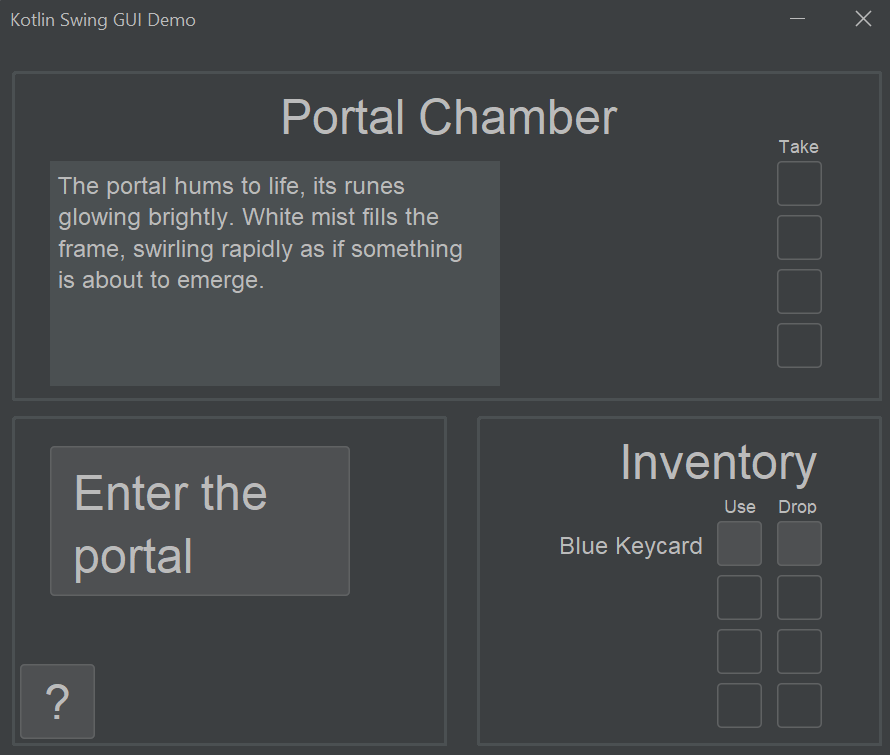

# Results of Testing

The test results show the actual outcome of the testing, following the [Test Plan](test-plan.md)

---

## Movement

Testing the movement system of my game, to make sure players can move where they should be able to, and not where they shouldn't

### Test Data Used

- Valid inputs (moving left when there is an unlocked room to the left, down when there is an unlocked room below, etc)
- Invalid inputs:
    - Trying to move into a room that does exist, but is locked
    - Trying to move somewhere that doesn't exist, e.g. off the map or into a wall.

### Test Result 1

This first test failed before I had even got to testing invalid inputs. The issue is that the vertical movement button didn't actually move me down. I'll have to debug my program to find the source of this issue.

I have found what was causing this issue:

In the line: `'v' -> gameMap[Triple...`, the 'v' should be a 'd' for 'down'. I must have accidentally written 'v' when refactoring my code. Now that this bug has been addressed, I will retest my code. _Note: from here on in, mouse clicks are shown my a yellow circle around the pointer. This is useful as it's otherwise impossible to tell when I am clicking greyed-out buttons._

### Test Result 2

We can see here that movement works as intended; we move where intended for valid inputs, and the game doesn't let us move into a room that is locked or doesn't exist.

---

## Door Unlocking

As a form of progression, my game has doors that need to be unlocked with found keys.

### Test Data To Use

In order, I will try:
  - Valid unlock input (using the right key for the room)
  - Invalid inputs:
    - Attempting to unlock the room with another door's key
    - Attempting to unlock a room without a key

### Test Result

As the above gif shows, the unlocking of scenes works as expected. Additionally, for valid inputs, the UI updates to show the scenes' newly unlocked states.

---

## Inventory System

Items and an inventory system are an integral part of my game. I want the player to be able to pick up, use, and drop items.

### Test Data To Use

I will split this test into 3 separate mini-tests to make things easier to follow. In order:
1. Picking up items:
   - With spare slots in the inventory (valid)
   - With only 1 space left in the inventory (boundary case)
   - With a full inventory (invalid)
2. Using items:
   - In rooms other than they were intended to be used in (in this case I will try to use the jerry can in the hallway, whereas it's meant to be used in the generator hall) (invalid)
   - In the room they are intended to be used in (valid)
3. Dropping items:
   - With spare space in that room (valid)
   - With only space for 1 item in that room (boundary case)
   - With no space for items in that room (invalid)

### Test Result

1. Taking items:

As the above gif shows, taking items works as intended (including for the boundary case), and the UI reacts to show that no more items can be picked up when the player's inventory is full.

2. Using items:

Works as intended; the item gets used only when the player is in the correct scene. This also demonstrates consumable items being used; unlike keycards, the jerry can got removed from the player's inventory once it was successfully used. I have also highlighted the fact the scene's descriptions have changed to further demonstrate that the item using system works correctly - though this will be explained in further detail in the 'activation system' tests.

3. Dropping items:

As can be seen, the dropping of items also works as intended (again, including for the boundary case), and the UI reacts to show that no more items can be dropped when there is no more space in that scene.

---

## Activation system

Another integral part of my game is the scene activation system. Specific items can be used to 'activate' one or more scenes - for example, using the jerry can in the generator room activates some of the rooms surrounding rooms, e.g. by changing their description to reflect that the lights have turned on. Some scenes may have multiple stages of activation, e.g. the control room has 3: Unpowered -> Powered -> Computer enabled. In this case, the control room should only be able to be activated from powered to computer enabled IF the power has been activated.

### Test Data To Use

In order, I will try:
- Invalid inputs, such as:
  - Trying to activate a scene with the right item, but when that scene isn't ready to be activated (e.g. trying to enable the control room computer with the finger before the power has been turned on)
  - Trying to activate a scene that can't be activated (e.g. most hallways - these don't have an activator)
  - Trying to activate a scene with the wrong item (e.g. trying to use the finger to power the generators)
- A valid input such as using the jerry can to power the generators

### Test Result

As the above gif shows, nothing happens - as intended - when an invalid input is made, and when a valid input is made, the item gets consumed and the relevant scenes are activated, and update their description to match.

---

## Win State

The player wins when they activate the portal and press the 'Enter the Portal' button.

### Test Data To Use

In order, I will try:
- Invalid win attempt (Try to go through the portal before activating it, when this shouldn't be allowed)
- Valid win attempt (complete the game as intended and go through the portal after activating it)

### Test Result

The above gif shows that the win state works as intended - the button only appears once the portal has been activated. Technically, this passes the test - but whilst this _was_ the expected result, the 'enter the portal' button is in the wrong position in the GUI, and the actual pop-up message seems rather unenthusiastic. So, while I am happy that this passes the test, I am going to change the button's UI position and the popup dialog's mesasage.

I have changed the 'enter the portal' button to be positioned properly:

---

## Game setup

On starting the game, some of the keycards should have randomised spawn locations.
While this isn't really a conventional test as I'm not providing valid or invalid inputs, this function of the game does still need to be tested to ensure everything is working correctly.

### Test Data To Use

I will initialise the game multiple times and see if the blue keycard changes its spawn location.

### Test Result

---